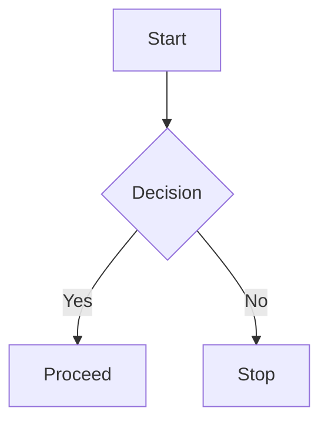
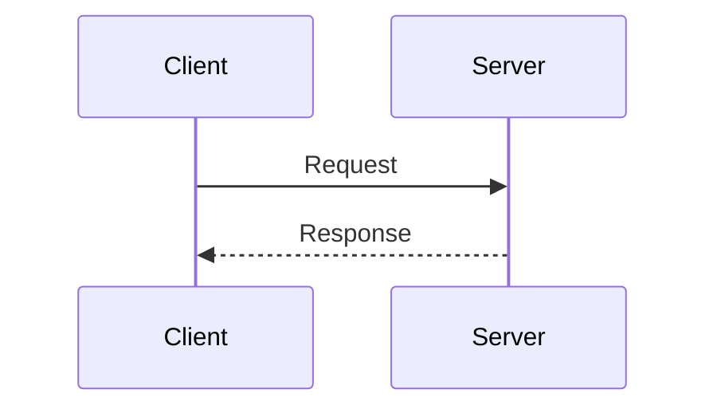
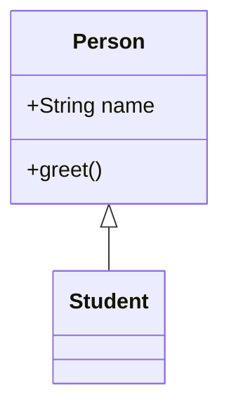
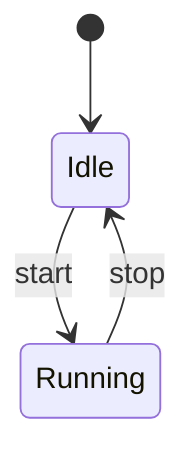
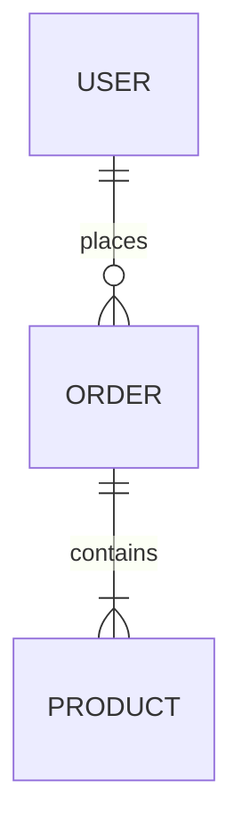
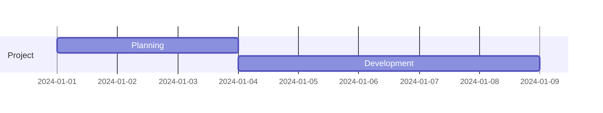
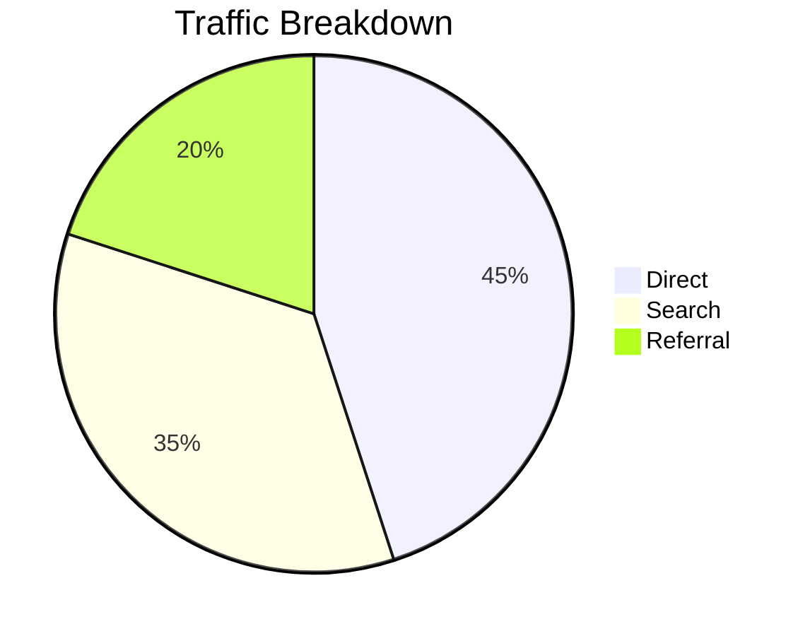
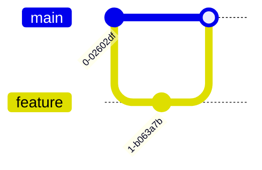
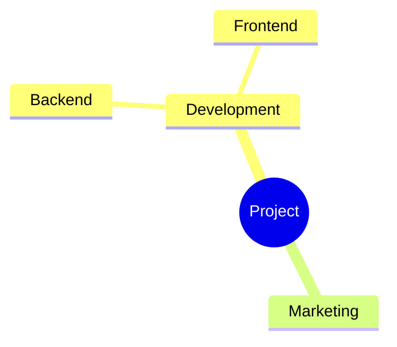
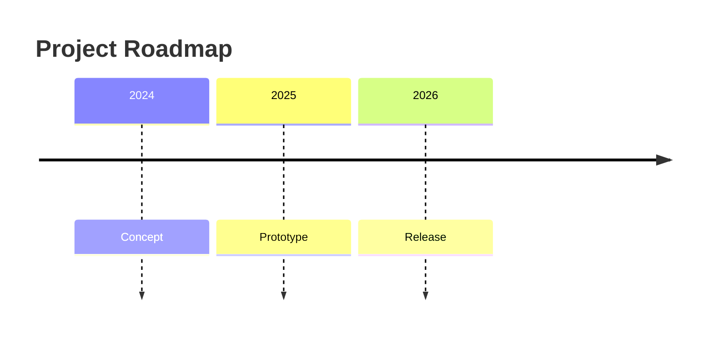

# Mermaid Diagram Examples

This document briefly explains and demonstrates all common Mermaid diagram types supported on GitHub.
[Docs](https://mermaid.js.org/)

---

## 1. Flowchart
Basic node → node diagrams.



---

## 2. Sequence Diagram
Shows interactions over time.



---

## 3. Class Diagram (UML)
Structures, classes, inheritance.



---

## 4. State Diagram
Finite-state transitions.



---

## 5. Entity Relationship Diagram (ERD)
Database-style relations.



---

## 6. Gantt Chart
Timelines, tasks, durations.



---

## 7. Pie Chart
Simple percentage breakdown.



---

## 8. Git Graph
Commit/branch visualization.



---

## 9. Requirement Diagram
High-level requirement → verification mapping.

```mermaid
requirementDiagram
    requirement speed {
      id: 1
      text: Must be fast
    }
    test testSpeed {
      id: T1
      text: Measure runtime
    }
    speed - verifies -> testSpeed
```

---

## 10. Mindmap
Idea organization & hierarchy.



---

## 11. Sankey Diagram (Beta)
Flow of values from source → target.

```mermaid
sankey-beta
    A[Input] 0.7:::a --> B[Processing]
    A 0.3:::a --> C[Loss]
```

---

## 12. Timeline Diagram
Chronological events.



---

## Summary

This file includes demonstrations of:
- Flowcharts  
- Sequence diagrams  
- Class diagrams  
- State diagrams  
- ER diagrams  
- Gantt charts  
- Pie charts  
- Git graphs  
- Requirement diagrams  
- Mindmaps  
- Sankey diagrams  
- Timelines  

All rendered using Mermaid inside Markdown.
